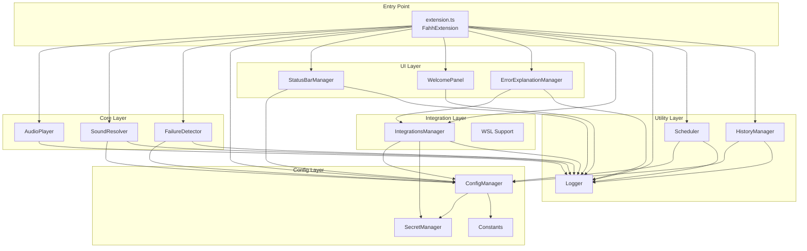

# Design Document: Production-Ready Refactor

## Overview

This design document specifies the technical architecture for refactoring the Fahh VS Code extension into a production-ready, professionally structured project. The refactor addresses critical security vulnerabilities (hardcoded API keys), configuration bugs (ignored user settings), code organization issues (flat file structure), and missing functionality (incomplete error explanation feature) while maintaining backward compatibility with all existing features.

### Goals

1. **Security**: Remove all hardcoded API keys and implement secure credential storage using VS Code's SecretStorage API
2. **Correctness**: Fix configuration system to respect user settings for AI provider selection
3. **Maintainability**: Reorganize flat file structure into logical modules with clear separation of concerns
4. **Completeness**: Finish incomplete features (error explanation) and add missing infrastructure (constants, types)
5. **Quality**: Add comprehensive documentation, type safety, error handling, and testing infrastructure

### Non-Goals

- Changing the extension's core functionality or user-facing features
- Rewriting the audio playback system
- Modifying the VS Code extension manifest structure
- Changing the build toolchain (TypeScript, Jest)

## Architecture

### High-Level Architecture

The extension follows a layered architecture with clear separation between core business logic, configuration management, UI components, external integrations, and utilities.



### Component Responsibilities

| Component | Responsibility | Dependencies |
|-----------|---------------|--------------|
| **extension.ts** | Extension lifecycle, command registration, component orchestration | All components |
| **AudioPlayer** | Cross-platform audio playback (Windows/macOS/Linux/WSL) | Logger |
| **SoundResolver** | Sound file resolution (packs, custom, per-source) | ConfigManager, Logger |
| **FailureDetector** | Monitor VS Code events for failures (tasks, terminals, diagnostics) | ConfigManager, Logger |
| **ConfigManager** | Read and validate user configuration | SecretManager, Constants |
| **SecretManager** | Secure API key storage using VS Code SecretStorage | None |
| **StatusBarManager** | Status bar UI (counter, flash, toggle) | ConfigManager, Logger |
| **WelcomePanel** | First-run welcome screen | Logger |
| **ErrorExplanationManager** | AI-powered error explanation webview | IntegrationsManager, Logger |
| **IntegrationsManager** | External integrations (AI, webhooks, TTS, gamification) | ConfigManager, SecretManager, Logger |
| **Logger** | Structured logging to output channel | None |
| **Scheduler** | Rate limiting, cooldowns, quiet hours, snooze | ConfigManager, Logger |
| **HistoryManager** | Failure history tracking and tree view | ConfigManager, Logger |

## Components and Interfaces

### New Project Structure

```
Fahh/
├── src/
│   ├── extension.ts                 # Entry point (unchanged location)
│   ├── core/                        # Core business logic
│   │   ├── audioPlayer.ts
│   │   ├── soundResolver.ts
│   │   └── failureDetector.ts
│   ├── config/                      # Configuration management
│   │   ├── configManager.ts         # Renamed from config.ts
│   │   ├── secretManager.ts         # NEW: Secure API key storage
│   │   └── constants.ts             # NEW: Centralized constants
│   ├── ui/                          # User interface components
│   │   ├── statusBar.ts
│   │   ├── welcome.ts
│   │   └── errorExplanation.ts
│   ├── integrations/                # External integrations
│   │   ├── integrations.ts
│   │   └── wsl.ts
│   ├── utils/                       # Utility functions
│   │   ├── logger.ts
│   │   ├── scheduler.ts
│   │   └── history.ts
│   └── types/                       # NEW: TypeScript type definitions
│       └── index.ts                 # Shared types and interfaces
├── resources/                       # Unchanged
├── __mocks__/                       # Unchanged
├── coverage/                        # Git-ignored
├── out/                             # Git-ignored
├── node_modules/                    # Git-ignored
├── package.json
├── tsconfig.json
├── jest.config.js
├── .gitignore                       # Updated
├── .vscodeignore
└── README.md                        # Updated

```

### Migration Path

Files will be moved as follows:

| Current Location | New Location | Changes |
|-----------------|--------------|---------|
| `src/audioPlayer.ts` | `src/core/audioPlayer.ts` | Import paths updated |
| `src/soundResolver.ts` | `src/core/soundResolver.ts` | Import paths updated |
| `src/failureDetector.ts` | `src/core/failureDetector.ts` | Import paths updated |
| `src/config.ts` | `src/config/configManager.ts` | Renamed, hardcoded keys removed, uses SecretManager |
| N/A | `src/config/secretManager.ts` | NEW: Secure API key storage |
| N/A | `src/config/constants.ts` | NEW: Centralized constants |
| `src/statusBar.ts` | `src/ui/statusBar.ts` | Import paths updated |
| `src/welcome.ts` | `src/ui/welcome.ts` | Import paths updated |
| `src/errorExplanation.ts` | `src/ui/errorExplanation.ts` | Completed getNonce(), import paths updated |
| `src/integrations.ts` | `src/integrations/integrations.ts` | Hardcoded keys removed, uses SecretManager |
| `src/wsl.ts` | `src/integrations/wsl.ts` | Import paths updated |
| `src/logger.ts` | `src/utils/logger.ts` | Import paths updated |
| `src/scheduler.ts` | `src/utils/scheduler.ts` | Import paths updated |
| `src/history.ts` | `src/utils/history.ts` | Import paths updated |
| N/A | `src/types/index.ts` | NEW: Shared type definitions |

### Core Interfaces

#### SecretManager Interface

```typescript
/**
 * Manages secure storage of API keys using VS Code's SecretStorage API.
 * 
 * @example
 * const secretManager = new SecretManager(context.secrets);
 * await secretManager.storeApiKey('openrouter', 'sk-or-v1-...');
 * const key = await secretManager.getApiKey('openrouter');
 */
export interface ISecretManager {
    /**
     * Store an API key securely.
     * @param provider - The provider name ('openrouter', 'copilot', etc.)
     * @param apiKey - The API key to store
     * @throws {Error} If the API key format is invalid
     */
    storeApiKey(provider: string, apiKey: string): Promise<void>;
    
    /**
     * Retrieve an API key securely.
     * @param provider - The provider name
     * @returns The API key, or null if not found
     */
    getApiKey(provider: string): Promise<string | null>;
    
    /**
     * Delete an API key.
     * @param provider - The provider name
     */
    deleteApiKey(provider: string): Promise<void>;
    
    /**
     * Check if an API key exists for a provider.
     * @param provider - The provider name
     * @returns True if the key exists
     */
    hasApiKey(provider: string): Promise<boolean>;
}
```

#### ConfigManager Interface

```typescript
/**
 * Manages extension configuration with validation and type safety.
 * Integrates with SecretManager for secure credential access.
 */
export interface IConfigManager {
    /**
     * Read the current configuration.
     * @returns Validated configuration object
     */
    readConfig(): Promise<FahhConfig>;
    
    /**
     * Update a configuration value.
     * @param key - Configuration key
     * @param value - New value
     * @param target - Configuration target (Global, Workspace, etc.)
     */
    updateConfig<K extends keyof FahhConfig>(
        key: K,
        value: FahhConfig[K],
        target?: vscode.ConfigurationTarget
    ): Promise<void>;
    
    /**
     * Reset all configuration to defaults.
     */
    resetAllSettings(): Promise<void>;
    
    /**
     * Get the AI provider API key securely.
     * @returns API key or null if not configured
     */
    getAiApiKey(): Promise<string | null>;
}
```

#### Constants Module

```typescript
/**
 * Centralized constants for the extension.
 * Eliminates magic strings and numbers throughout the codebase.
 */
export const CONSTANTS = {
    // Extension metadata
    EXTENSION_ID: 'fahh',
    EXTENSION_NAME: 'Fahh',
    
    // Configuration keys
    CONFIG_SECTION: 'fahh',
    CONFIG_KEYS: {
        ENABLED: 'enabled',
        SOUND_PACK: 'soundPack',
        SOUND_PATH: 'soundPath',
        AI_PROVIDER: 'aiProvider',
        OPENROUTER_API_KEY: 'openrouter